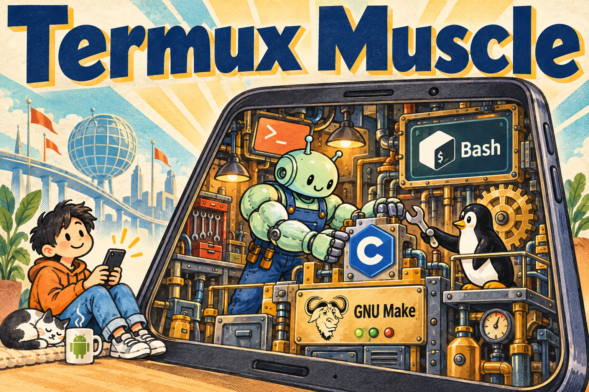

# Termux Muscle

**Install, run, update and recover Claude Code on Android with Termux.**



[Artwork license and credits](docs/images/README.md). The Android robot is reproduced or modified from work created and shared by Google and used according to terms described in the [Creative Commons 3.0 Attribution License](https://creativecommons.org/licenses/by/3.0/).

An independent community project from [Octocore Autonomous Systems](https://github.com/octocore-autonomous-systems) (OAS). **Not affiliated with, endorsed by, sponsored by, or authorized by Anthropic.** Claude and Claude Code are Anthropic products; your use of them remains subject to Anthropic's terms and account access.

> **0.2.0 pins Claude Code 2.1.270** on Android **ARM64 / aarch64**. Native installation, command/manual setup, recovery and an authenticated Sonnet 5 tool workflow passed on **Samsung Galaxy S26 Ultra, Android 16, Termux 0.118.3 (GitHub)**. See the scoped [0.2.0 report](compatibility/galaxy-s26-ultra-0.2.0-20260915.md); other configurations need volunteer evidence.

[Install](#install) · [Commands](#everyday-use) · [Device matrix](#device-compatibility) · [Troubleshooting](docs/troubleshooting.md) · [Contribute](CONTRIBUTING.md)

## Why this exists

A Claude Code update can leave Termux with a launcher and no usable binary. Termux Muscle manages that installation boundary and the work that follows:

- Downloads Anthropic's official ARM64 musl package and verifies its bytes before use.
- Supplies a small PRoot environment with the musl loader, Termux shell, live DNS and certificates.
- Checks a candidate before making it current; keeps a previous release for rollback.
- Separates runtime updates, account authentication and management-tool updates.
- Sets up the normal `claude` command after runtime validation, backing up replaced commands for eligible restoration.
- Preserves your Claude credentials, settings and projects.

This is a **Claude Code lifecycle manager**, not a general agent runtime. It does not provide model access or make Android an officially supported Anthropic platform. [Architecture and limits →](docs/architecture.md)

## Install

Run this in a **native Termux shell on an ARM64 Android device**:

```sh
curl -fsSL https://github.com/octocore-autonomous-systems/termux-muscle/releases/download/v0.2.0/install.sh | sh
```

The installer adds missing Termux prerequisites with `pkg`, verifies the release's source archive, builds the C helper locally and runs its offline tests before installation. Bash manages the lifecycle; the helper uses json-c, libarchive and OpenSSL. Build and test tools are Clang, make, pkg-config and diffutils; tar and gzip unpack the source. Runtime tools are Bash, PRoot, coreutils, ripgrep, curl and CA certificates. Termux's `mandoc` package provides the manual viewer. The project requires no Python, npm or Ubuntu installation.

Local compilation requires downloading a C toolchain when one is not already installed. It builds our helper against your Termux environment; Anthropic's proprietary Claude Code executable is downloaded separately and remains unmodified.

After the runtime passes validation, the installer sets up `claude` in the Termux prefix, `~/.local/bin`, and at the first existing executable `claude` found elsewhere on PATH. Replaced regular files and symlinks are backed up. Start Claude Code and use its normal authentication flow:

```sh
claude auth login
claude
```

The manager is made available in `$PREFIX/bin` and `~/.local/bin` without changing shell startup files. The installer also installs one manual page:

```sh
termux-muscle --version
man termux-muscle
```

An unrelated existing command named `termux-muscle` or an unrelated manual is preserved; the installer prints the full owned path when needed. Shell aliases, functions and cached command locations can override executable PATH lookup; open a fresh shell if the old command persists. See [command recovery](docs/troubleshooting.md#command-selection-and-recovery).

For a custom setup, pass `--no-link` to install the runtime while preserving Claude command entries. Pass `--no-install` to install only the management tool and manual, without downloading or redirecting Claude. To inspect the bootstrap or supply these options, download the same `install.sh` URL to a file, read it, then run `sh install.sh --no-link` or `sh install.sh --no-install`.

## Everyday use

| Task | Command |
| --- | --- |
| Start Claude Code | `claude` |
| Authenticate through Claude Code | `claude auth login` |
| Run Claude with its own arguments | `claude --model claude-opus-5` |
| Read the installed manual | `man termux-muscle` |
| Inspect installed and retained releases | `termux-muscle versions` |
| Check installation health | `termux-muscle doctor` |
| Install the version tested for this project release | `termux-muscle update` |
| Restore the previous local release | `termux-muscle rollback` |
| Rebuild from verified cached downloads | `termux-muscle repair --offline` |
| Update this management tool | `termux-muscle self-update` |
| Write a device report for review | `termux-muscle test --output report.json` |
| Remove this installation and restore eligible commands/manual | `termux-muscle uninstall` |

Default updates stay with the project's compatibility pin. An explicitly requested upstream version is experimental until tested on your device; see `update --help`. Installation and ordinary health checks make no paid model requests. Uninstall restores replaced commands only while their installed entries remain unchanged and owned; it preserves later foreign changes and keeps the recovery evidence. Claude account data, settings, sessions, projects and installed Termux packages remain intact.

`rollback` restores a previous **Claude Code runtime**. Management-tool self-update is separate: 0.2.0 rejects `self-update --version` requests below 0.2.0 because older managers cannot read the new manual ownership records. Do not run an old installer over a newer installation. An intentional manager downgrade requires uninstalling with the current manager first.

## Device compatibility

A configuration is **device + Android/API + Termux build**, with ABI, kernel, page size and dependency versions in its report. Android version affects available system interfaces; hardware and vendor firmware can change the kernel and process behavior. Neither dimension alone proves compatibility.

The capability matrix grows only when someone supplies a report. **PASS** means that named check passed; **FAIL** means it failed; **SKIP** means untested. A maintainer report is distinguished from a community report.

| Tested configuration | Install | Start | Shell namespace | Claude tools | Manual | Update | Rollback | Removal | Evidence |
| --- | :---: | :---: | :---: | :---: | :---: | :---: | :---: | :---: | --- |
| **0.2.0, 2026-09-15 UTC** · Samsung Galaxy S26 Ultra · SM-S948U · Android 16 / API 36 · Termux 0.118.3 (GitHub) | PASS¹ | PASS | PASS | PASS | PASS | PASS | PASS | PASS | [Maintainer report](compatibility/galaxy-s26-ultra-0.2.0-20260915.md) · [JSON](compatibility/galaxy-s26-ultra-0.2.0-20260915.json) |
| **0.1.0, 2026-09-14** · Samsung Galaxy S26 Ultra · SM-S948U · Android 16 / API 36 · Termux 0.118.3 (GitHub) | PASS | PASS | PASS | PASS | — | PASS | PASS | PASS | [Historical report](compatibility/galaxy-s26-ultra-20260914.md) · [JSON](compatibility/galaxy-s26-ultra-20260914.json) |

¹ The fresh **0.2.0** installation result covers the real native source bootstrap with private command/manual destinations and verified original vendor archives. It does not claim public HTTPS delivery. Its local namespace probe passed; a separate authenticated Sonnet 5 fixture also passed actual Bash tool execution, native shell, portable shebang, ripgrep and nested launcher checks. The indexed manual installed, refreshed and was removed correctly; 0.1.0 did not ship this manual. Reports include exact Claude Code, loader, compiler, C libraries, PRoot, Bash, ripgrep and package versions, including `mandoc` for 0.2.0. See [testing](docs/testing.md) for each check's scope. Background/screen-off behavior and actual MCP tool calls remain untested; the older report records the vendor's default cross-session messaging UID-mapping failure.

**Have a different phone, tablet, Android release or Termux version? Please help test.** We especially need other manufacturers, Android/kernel releases, 4 KiB and 16 KiB page-size devices, and different Termux distributions/builds.

```sh
termux-muscle test --output report.json
```

Review the local JSON, then [open a Device compatibility issue](https://github.com/octocore-autonomous-systems/termux-muscle/issues/new?template=device-compatibility.yml) and attach or paste it. Nothing is uploaded automatically. The report uses an allowlist of platform details and check results; do not add tokens, complete environment dumps or private session logs. No account is needed for the default checks. An explicit `--model MODEL_ID` test uses your authenticated account and may incur usage.

## Claude Code and models

Project versions and Claude Code versions are separate. **0.2.0** retains **Claude Code 2.1.270** and musl **1.2.6-r2**, unchanged from 0.1.0. [compatibility.json](compatibility.json) is the machine-readable record; each published release includes matching notes and checksums. This manager update does not add a new model or account entitlement.

| Documented model | Model ID | Minimum Claude Code |
| --- | --- | --- |
| Fable 5.1 | `claude-fable-5-1` | 2.1.257 |
| Opus 5 | `claude-opus-5` | 2.1.219 |
| Sonnet 5 | `claude-sonnet-5` | 2.1.197 |

Model documentation was checked **2026-09-14** against [Anthropic's model configuration documentation](https://code.claude.com/docs/en/model-config). **Sonnet 5 passed exact authenticated tool acceptance with 0.2.0 on 2026-09-15 UTC.** The dated **0.1.0** report separately retains Opus 5/Sonnet 5 PASS results and a direct Fable 5.1 response with automated upstream fallback/refusal; those observations remain visible in the [historical report](compatibility/galaxy-s26-ultra-20260914.md#model-observations). Opus and Fable were not newly verified for 0.2.0. Availability depends on your account, provider and organization policy; no Opus 5.1 identifier was established by the evidence.

## Help build something dependable

Bug reports, device evidence and small fixes are welcome. [CONTRIBUTING.md](CONTRIBUTING.md) explains branch names, tests and pull requests. The [engineering record](docs/engineering.md) connects the defects we encountered with design decisions and acceptance evidence.

Our source is [MPL-2.0](LICENSE). Claude Code and separately downloaded dependencies retain their own licenses and terms. We learned from several existing Termux projects and the musl approach documented by Khronos31; see [CREDITS.md](CREDITS.md).
